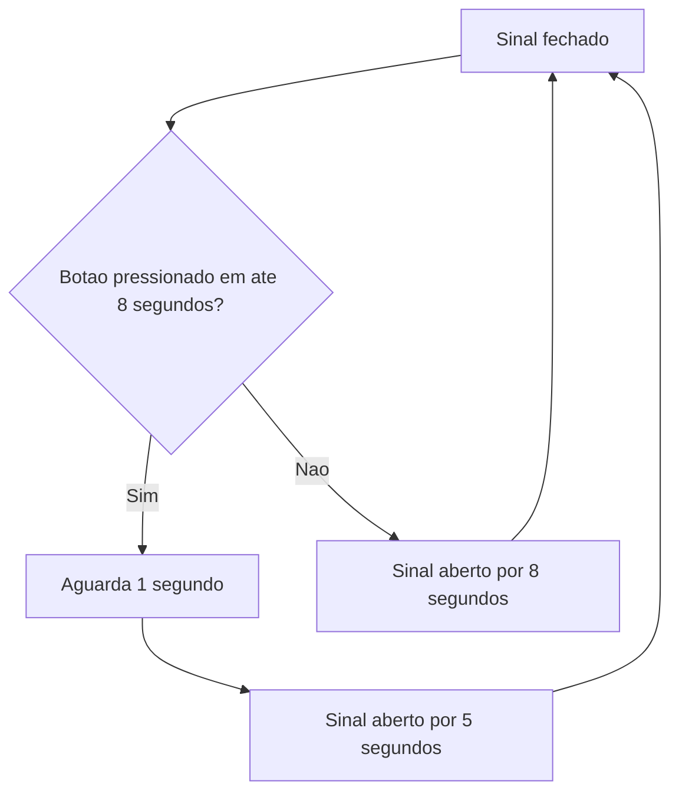

# 🚦 Semáforo inteligente com Raspberry Pi Pico W e OLED

Um projeto em **C** que simula um semáforo para pedestres usando a
**Raspberry Pi Pico W**, um LED RGB, um botão e um display OLED SSD1306.

Ao apertar o botão, o sistema identifica a solicitação do pedestre, altera o
estado do sinal e mostra instruções diretamente no display. Simples, visual e
uma ótima forma de praticar GPIO, I2C e programação embarcada. ✨

## 🎯 O que o projeto faz

- Controla as cores vermelha e verde de um LED RGB.
- Lê o botão A usando o resistor pull-up interno da Pico.
- Exibe mensagens em um OLED de 128 × 64 pixels.
- Atualiza o sinal automaticamente quando ninguém aperta o botão.
- Gera um arquivo `.uf2` pronto para gravar na placa.

## 🧠 Como funciona

O programa possui dois estados principais:

### 🔴 Sinal fechado

- Acende o LED vermelho.
- Mostra `SINAL VERMELHO` e `AGUARDE` no OLED.
- Verifica o botão a cada 100 ms durante 8 segundos.

### 🟢 Sinal aberto

- Acende o LED verde.
- Mostra `SINAL VERDE` e `ATRAVESSAR A RUA` no OLED.

Quando o botão é pressionado, o sistema aguarda 1 segundo e libera a passagem
por 5 segundos. Se ninguém apertar o botão durante o período de espera, a
passagem é liberada automaticamente por 8 segundos.



## 🔌 Ligações utilizadas

| Componente | Pino da Pico W |
| --- | ---: |
| LED vermelho | GPIO 13 |
| LED verde | GPIO 11 |
| LED azul | GPIO 12 |
| Botão A | GPIO 5 |
| OLED SDA | GPIO 14 |
| OLED SCL | GPIO 15 |

### Configuração do OLED

| Propriedade | Valor |
| --- | --- |
| Controlador | SSD1306 |
| Resolução | 128 × 64 pixels |
| Interface | I2C 1 |
| Frequência | 400 kHz |
| Endereço | `0x3C` |

> [!NOTE]
> O botão usa o pull-up interno. Por isso, ele é considerado pressionado
> quando o GPIO apresenta nível lógico baixo.

## 📁 Estrutura do projeto

```text
.
├── Oled2.c                 # Programa principal e lógica do semáforo
├── ssd1306.c               # Implementação do driver do display
├── ssd1306.h               # Interface do driver SSD1306
├── font.h                  # Fonte usada para desenhar os textos
├── CMakeLists.txt          # Configuração de compilação
├── pico_sdk_import.cmake   # Importação do Raspberry Pi Pico SDK
└── README.md               # Documentação do projeto
```

## 🛠️ Tecnologias

- Linguagem C
- Raspberry Pi Pico SDK
- CMake e Ninja
- Visual Studio Code
- Extensão oficial Raspberry Pi Pico
- Comunicação I2C

## 🚀 Como compilar

### Pelo VS Code

1. Instale a extensão oficial **Raspberry Pi Pico**.
2. Clone este repositório:

   ```bash
   git clone https://github.com/jotavieira1930-code/C-digo-Oled.git
   ```

3. Abra a pasta clonada no VS Code.
4. Confirme que a placa selecionada é `pico_w`.
5. No painel **Raspberry Pi Pico Project**, clique em **Compile Project**.
6. Após a compilação, localize `build/Oled2.uf2`.

## 💾 Como gravar na Pico W

1. Desconecte a placa do USB.
2. Mantenha o botão **BOOTSEL** pressionado.
3. Conecte o cabo USB e solte o botão.
4. Aguarde a unidade `RPI-RP2` aparecer no computador.
5. Copie `build/Oled2.uf2` para essa unidade.

A Pico W reiniciará automaticamente e começará a executar o programa. 🎉

## 🔍 Arquivo principal

A função `main()` prepara os LEDs, o botão e o barramento I2C. Depois disso, o
programa entra em um laço infinito alternando os estados do semáforo.

As funções mais importantes são:

- `SinalFechado()`: acende o vermelho e atualiza o OLED.
- `SinalAberto()`: acende o verde e libera a passagem.
- `WaitWithRead()`: espera sem deixar de verificar o botão.

## 💡 Ideias para evoluir o projeto

- Adicionar o estado amarelo antes da troca do sinal.
- Mostrar uma contagem regressiva no OLED.
- Usar interrupções para tratar o botão.
- Adicionar um buzzer para acessibilidade.
- Aplicar debounce por software no botão.

## 📚 Créditos

O driver do SSD1306 utilizado no projeto foi criado por
[David Schramm](https://github.com/daschr) e é distribuído sob a licença MIT,
conforme indicado nos arquivos `ssd1306.c` e `ssd1306.h`.

---

Feito para aprender, testar e colocar a Pico W para trabalhar. 🚀
